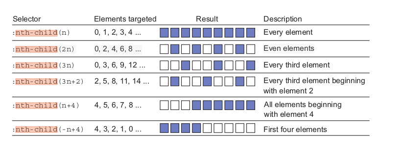

# 5. CSS Selektoren & Box Modell

> Lernziele
> - verschiedene Selektoren besprechen
> - Box Model
>   - Inhalt, Padding, Border, Margin
>   - content-box, border-box
>   - float layouts
>   - calc

**Wiederholung**

- Grafiken
    - AVIF
        - modern
    - webp
        - modern
    - jpeg
    - gif
        - veraltet
    - png
    - svg
        - verlustfreies Vergrößern
        - Vektorgrafik

- Einbindungsmöglichkeiteb von Grafiken
    - `figure`, 
        - wir können grafiken gruppieren und dem eine Bildunterschrift geben mit `figcaption`
    - innerhalb können wir dann `img` tags verwenden
    
    - bsp.: Pfad `../images/dog.webp`

**relative Pfade**
```bash
project_ordener
├── überordner
|    └── html_ordner
|          └──   index.html   enthält 
|
└── images
    ├── dog.avif
    ├── dog.jpg
    ├── dog.webp
    └── logo.svg
```

- `picture` und `source` tag
    - Bilder im passenden Seitenverhältnis bzw. passenden Ausschnitt liefern
    - Verschiedene Formate können angeboten werden
        - so können die modernsten Formate verwendet werden, die nicht all Browser unterstützen
            - bzw. format für ältere browser können unterstützt werden
```html
<picture>
    <source media="(max-width:600px)" srcset="dog_300_300.webp">
    <source media="(max-width:800px)" srcset="dog_600_600.webp">
    
</picture>
```

```html
<picture>
    <source srcset="dog.avif" type="image/avif">
    <source srcset="dog.webp" type="image/webp">
    
</picture>
```

- Favicons
    - logo einer webseite
    - Favicons sind kleine Icons, die in der Adressleiste, im Tab oder in Favoriten angezeigt werden.

- Vektorgrafiken
    - wir können `svgs` als Datei speichern und in html über das `img` tag einbinden
    - SVG kann direkt im HTML eingebettet werden.

https://pe.app/response_links/44624094-5f76-4c21-bb81-8649cc1b84ec (SVG)


# CSS Selektoren

 CSS bietet eine leistungsfähige Syntax, um Elemente zu **beschreiben und auszuwählen**.

### Typselektoren

- wählt **alle HTML-Elemente eines bestimmten Typs** anhand ihres **Elementnamens** aus (z. B. `p`, `section`, `img`).

**Beispiel:**

```css
section {
  width: 100%;
  display: flex;
  flex-direction: row;
}
article {
  box-shadow: 0 4px 8px rgba(0, 0, 0, 0.2);
  width: 30%;
  margin: 10px;
  padding: 5px;
  font-size: 2.5vw;
  text-align: center;
}
img {
  width: 100%;
}
```

### Klassenselektor:

Spricht **alle HTML-Elemente** an, die ein bestimmtes **class-Attribut** besitzen.

```css
.Karte { ... }
```

```html
<div class="Karte">
    <p>Hallo</p>
    
</div>
<div class="Karte">
    <p>Hallo</p>
    
</div>
```

 **Namensregeln für Klassen**:
  Erlaubt sind **Buchstaben (a–z, A–Z)**, **Ziffern (0–9)**, **Bindestrich (-)** und **Unterstrich (_)**.
  Der Name **darf nicht mit einer Zahl beginnen**.

  * **Mehrere Klassen pro Element**:

  ```html
  <article class="Karte Karten-text">....
  ```

* **Kombination mit Elementtypen**:
Durch Verknüpfung mit einem Elementnamen wird die Regel nur auf diesen Typ angewendet.
```css
article.Karte { ... }
```

* **Kombination mehrerer Klassen**:
  Wenn zwei Klassen gleichzeitig erforderlich sind, werden sie **mit Punktnotation** kombiniert.


```css
.Karte.Karten-text { ... }
```

* **Verwendung im Beispiel**:

  * `.cards` = Container für Karten (Flexbox).
  * `.card` = einzelne Karte mit Schatten und Abstand.
  * `.card-text` = Textgestaltung in der Karte.
  * `.img-card` = Bildbreite auf 100 % der Karte.
  * `article.card-text` = Farbe nur bei Artikeln mit Klasse `card-text`.

---

### ID-Selektor

  Wählt ein **einziges HTML-Element** anhand seines `id`-Attributs aus.

* **Syntax:**

```css
#idname { /* CSS-Regeln */ }
```

* **Einmaligkeit:**
  Eine **ID darf nur einmal pro HTML-Dokument** vergeben werden.
  → Jede ID ist **eindeutig**, im Gegensatz zu **Klassen**, die mehrfach verwendet werden dürfen.

* **Beispiel:**

  ```html
  <section id="cards">...</section>
  ```

    ```css
  #cards {
    width: 100%;
    display: flex;
    flex-direction: row;
  }
  ```

* **Verknüpfungen:**
ID-Selektoren können mit anderen Selektoren kombiniert werden


<article id="haupttext">

`article#haupttext { ... }`

* **Universalselektor (`*`)**:

Wählt **alle HTML-Elemente** im gesamten Dokument aus.

  ```css
  * {
    font-family: Arial, sans-serif;
  }
  ```

* **Wirkung:**
  Die Regel wird **auf jedes Element** angewendet (z. B. `body`, `p`, `h1`, `a`, `img`, usw.).
  → Ideal, um globale **Standardeinstellungen** (z. B. Schrift, Margin, Padding) festzulegen.


* **Typische sichere Verwendung:**
  Reset oder Normalize-Styles, z. B.:

  ```css
  * {
    margin: 0;
    padding: 0;
    box-sizing: border-box;
  }
  ```

###  Attributselektor:

  Wählt **alle HTML-Elemente**, die ein bestimmtes **Attribut** besitzen.

* **Syntax:**

  ```css
  [attributname] { ... }
  ```

→ Beispiel: `[title]` betrifft **alle Elemente**, die ein `title`-Attribut haben.

* **Beispiel:**

  ```css
  [title] {
    text-decoration: none;
    font-weight: 800;
    color: blue;
  }
  ```

 * **Kombination mit Typselektor:** 

 ```css
 img[title] {
    width: 100%
 }
```

**Praxis-Tipp:**
Attributselektoren sind nützlich, wenn du **bestimmte Eigenschaften (z. B. href, title, alt)** ansprechen willst – etwa für **Formularfelder, Links oder Tooltips**.

#### **1 Genau passender Attributwert**
 **Syntax:**

```css
[attributname=attributwert]
```

Wählt Elemente, bei denen der Attributwert **genau übereinstimmt**.

 **Beispiel:**

```css
[type=text] {
  background-color: azure;
  margin-bottom: 5px;
}
```

→ Wählt alle Elemente mit `type="text"` (z. B. Textfelder)

#### **2 Enthält ein einzelnes Wort (mit Leerzeichen getrennt)**

**Syntax:**

```css
[attributname~=attributwert]
```

Wählt Elemente, bei denen der Attributwert **ein bestimmtes Wort** enthält, das **durch Leerzeichen getrennt** ist.

```css
[title~=Pflicht] {
  text-decoration: underline;
}
```

#### **3 Beginnt mit einem Bindestrich-getrennten Wert**

 **Syntax:**

```css
[attributname|=attributwert]
```

Wählt Elemente, bei denen der Attributwert **genau** oder **mit einem Bindestrich** erweitert vorkommt.

**Beispiel:**

```css
[class|=test] {
  padding: 5px;
  background-color: black;
  color: white;
}
```

→ Wählt Elemente mit `class="test"` **oder** `class="test-01"`.

---

####  **Spezifischere Kombinationen**

Attributselektoren können mit anderen Selektoren kombiniert werden:

```css
button[type=submit] {
  margin-top: 1em;
  width: 150px;
}
```

→ Betrifft nur `<button>`-Elemente mit `type="submit"`.

#### Pseudoklassen

| **Pseudoklasse**  | **Beschreibung**                                                           |
| ----------------- | -------------------------------------------------------------------------- |
| `:hover`          | Wird aktiv, wenn der Mauszeiger über einem Element schwebt.
| `:active`         | Gilt während des Klicks auf ein Element.                                   |
| `:focus`          | Markiert ein Element, das den Tastaturfokus hat (z. B. ein Eingabefeld).
| `:visited`        | Für bereits besuchte Links.                                                |
| `:link`           | Für noch nicht besuchte Links.                                             |
| `:first-child`    |Wählt das **erste Kind** eines Elternelements.  
| `:last-child`     | Wählt das **letzte Kind** eines Elternelements.                            |
| `:nth-child(n)`   | Wählt das **n-te Kind** (oder jedes n-te mit Formel, z. B. `2n`).          |
| `:nth-of-type(n)` | Wählt das **n-te Element eines bestimmten Typs** (z. B. das zweite `<p>`). |

```css
a:hover {
    color: red;
}

li {
    margin-top: 1em;
}

ul:first-child {
    margin-top: 0;
}
```




#### weitere Beispiele für Selektoren:


| Selektor                       | Bedeutung                                          |
| ------------------------------ | -------------------------------------------------- |
| `p[lang="fr"]`                 | Absatz mit Attribut `lang="fr"`                    |
| `[name="x"]`                   | Alle Elemente mit `name="x"`                       |
| `span.fatal.error`             | `<span>` mit Klassen `fatal` und `error`           |
| `span[lang="fr"].warning`      | `<span>` mit `lang="fr"` und Klasse `warning`      |
| `#log span`                    | Alle `<span>` innerhalb von Element mit `id="log"` |
| `#logo > span`                 | Nur direkte `<span>`-Kinder von `id="logo"`        |
| `body h2:first-child`          | Erstes `<h2>` in `<body>`                          |
| `img + p.caption`              | `<p class="caption">` direkt nach einem ``    |
| `h1 ~ p`                       | Alle `<p>`, die Geschwister von `<h1>` sind        |
| `button, input[type="button"]` | Alle Buttons und Button-Inputs                     |

## Mastering the Box Model**


```html
<body>
  <header>
    <h1>Überschrift</h1>
  </header>
  <div class="container">
    <main class="main">
      <h2>Überschrift</h2>
      <p>
        Hauptbereich
      </p>
    </main>
    <aside class="sidebar">
      <div class="widget"></div>
      <div class="widget"></div>
    </aside>
  </div>
</body>
```
```html
<body>
  <header>
    <h1>Überschrift</h1>
  </header>
  <div class="container">
    <main class="main">
      <h2>Überschrift</h2>
      <p>
        Hauptbereich
      </p>
    </main>
    <aside class="sidebar">
      <div class="widget"></div>
      <div class="widget"></div>
    </aside>
  </div>
</body>
```

* Zunächst werden einige **grundlegende Styles** definiert.

* Dabei wird zuerst die **Schriftart** für die gesamte Seite festgelegt.

* Anschließend werden **Hintergrundfarben** für die Seite und die wichtigsten **Container-Elemente** vergeben.

* Diese Farben dienen dazu, **Größe und Position** der Bereiche während der Arbeit besser zu erkennen.

* Da die **Sidebar derzeit leer** ist, besitzt sie **standardmäßig keine Höhe**.

* Um sie sichtbar zu machen, wird **Padding** (Innenabstand) hinzugefügt.

* Auch die anderen Container werden später **Padding erhalten**, dies erfolgt jedoch später.

* Aktuell soll dieser **CSS-Code in das Stylesheet eingefügt** werden.


```css
body {
  background-color: #eee;
  font-family: Helvetica, Arial, sans-serif;
}

header {
  color: #fff;
  background-color: #0072b0;
  border-radius: .5em;
}


.main {
  background-color: #fff;
  border-radius: .5em;
}

.sidebar {
  padding: 1.5em;
  background-color: #fff;
}
```


* Im nächsten Schritt werden die **zwei Spalten** des Layouts positioniert.
* Dafür wird zunächst ein **float-basiertes Layout** verwendet.
* Sowohl das **Hauptelement (`main`)** als auch die **Seitenleiste (`sidebar`)** werden **nach links gefloatet**.
* Dem Hauptelement wird eine **Breite von 70 %** zugewiesen.
* Die Seitenleiste erhält eine **Breite von 30 %**.
* Das **Stylesheet** wird entsprechend angepasst, damit diese **Layoutstruktur umgesetzt** wird.


```css
.main {
  float: left;
  width: 70%;
  background-color: #fff;
  border-radius: .5em;
}

.sidebar {
  float: left;
  width: 30%;
  padding: 1.5em;
  background-color: #fff;
}
```


* Statt dass die beiden Spalten **nebeneinander erscheinen**, werden sie **umgebrochen** (line wrap).

* Obwohl für die Spalten **Breiten von 70 % und 30 %** definiert wurden, **überschreiten sie gemeinsam 100 %** der verfügbaren Breite.

* Ursache ist das **Standardverhalten des CSS-Box-Modells** (siehe Abbildung 3.4).

* Wenn man in CSS die **Breite oder Höhe eines Elements** festlegt, bezieht sich dieser Wert **nur auf den Inhaltsbereich (content)**.

* **Padding**, **Border** und **Margin** werden **zusätzlich** zur angegebenen Breite bzw. Höhe addiert.

* Beispiel:
  * Ein Element mit

    * `width: 300px`,
    * `padding: 10px`
    * und `border: 1px`
      → hat eine **tatsächliche Breite von 322 px** (300 + 10 + 10 + 1 + 1).

* Dieses Verhalten wird **komplizierter**, wenn **unterschiedliche Maßeinheiten** (z. B. px, em, %) kombiniert werden.

* Es wird gezeigt:

  * Die **Hauptspalte** wird **nach links gefloatet** und auf **70 % Breite** gesetzt.
  * Die **Sidebar** wird ebenfalls **nach links gefloatet**, mit **30 % Breite**.

* Zusätzlich besitzt die Sidebar **1.5 em Padding links und rechts**.
* Dadurch ergibt sich eine **Gesamtbreite von über 100 %** (100 % + 3 em).
* Um in das Layout zu passen, **müssen sich die Container umbrechen**.


### **Boxmodel anpassen**

* Aufgrund der zuvor beschriebenen Probleme ist das **Standardverhalten des Box-Modells** oft **nicht wünschenswert**.

* In der Regel möchte man, dass die **angegebene Breite** eines Elements **auch Padding und Border** einschließt.

* CSS bietet hierfür die Möglichkeit, das Verhalten über die Eigenschaft **`box-sizing`** anzupassen.

* **Standardwert:** `box-sizing: content-box;`

  * Dabei beziehen sich **`width`** und **`height`** **nur auf den Inhaltsbereich** (content).
  * **Padding**, **Border** und **Margin** werden **außerhalb** dieser Werte hinzugefügt.

* **Alternative Einstellung:** `box-sizing: border-box;`

  * In diesem Fall umfasst die angegebene **Breite und Höhe** den **Inhalt, das Padding und die Border** gemeinsam.
  * Dieses Verhalten ist in diesem Beispiel **gewünscht**, da es das Layout **vereinheitlicht und exakter planbar** macht.

Teacher: Mache skizze zu beiden einstellungen

  * Hier sorgt das Padding **nicht mehr dafür**, dass das Element breiter wird.
  * Stattdessen wird der **Inhaltsbereich kleiner**, während die **Gesamtbreite gleich bleibt**.
  * Dasselbe gilt auch für die **Höhe**.

* Wenn die betroffenen Elemente auf **`box-sizing: border-box;`** umgestellt werden,

  * **passen sie nebeneinander auf eine Zeile**,
  * **unabhängig vom linken und rechten Padding** (siehe Abbildung 3.6).

```css
main {
  box-sizing: border-box;
  float: left;
  width: 70%;
  background-color: #fff;
  border-radius: .5em;
}

.sidebar {
  box-sizing: border-box;
  float: left;
  width: 30%;
  padding: 1.5em;
  background-color: #fff;
  border-radius: .5em;
}
```


* Die bisherige Anpassung mit **`box-sizing: border-box;`** wurde nur auf **zwei Elemente** angewendet.

* Allerdings können **auch andere Elemente** im Layout **dieselben Probleme** verursachen.

* Es ist daher sinnvoll, die Einstellung **universell für alle Elemente** vorzunehmen, um sie **nicht jedes Mal einzeln anpassen** zu müssen.

* Dafür wird der **universelle Selektor `*`** verwendet, der **alle Elemente auf der Seite** anspricht.

* Zusätzlich werden die **Pseudo-Elemente `::before` und `::after`** mit einbezogen.

* Der entsprechende CSS-Code lautet:

  ```css
  *,
  ::before,
  ::after {
    box-sizing: border-box;
  }
  ```

* Diese Regel sollte **am Anfang des Stylesheets** stehen.

* Nach dem Anwenden gilt:

  * **Höhe und Breite** (`height` und `width`) geben nun **immer die tatsächlichen Gesamtmaße** eines Elements an.
  * **Padding** verändert die Breite oder Höhe **nicht mehr**.

* **Hinweis:**

  * Das Einfügen dieses Codeblocks **zu Beginn des Stylesheets** gilt heute als **gängige Best Practice**.


* Für ein ansprechenderes Layout ist es oft **visuell besser**, einen **kleinen Abstand (Gutter)** zwischen Spalten einzufügen.

* Manchmal lässt sich dieser Effekt durch **Padding** an einer Spalte erzielen,

  * jedoch **funktioniert diese Methode nicht immer** zuverlässig.

* Wenn **beide Spalten** (wie im Beispiel) eine **eigene Hintergrundfarbe oder einen Rahmen** besitzen,

  * soll der **Abstand zwischen den äußeren Rändern (Borders)** sichtbar sein.
  * In **Abbildung 3.7** ist dieser **graue Zwischenraum** zwischen den weißen Bereichen zu sehen.

* Es gibt **mehrere Möglichkeiten**, dieses Erscheinungsbild umzusetzen.

* Eine Variante besteht darin, **einer der Spalten einen Außenabstand (Margin)** zu geben und die **Breite entsprechend anzupassen**.


  * und ihre Breite um diesen Wert **auf 29 % reduziert** wird.

* Der zugehörige CSS-Code lautet:

  ```css
  .main {
    float: left;
    width: 70%;
    background-color: #fff;
    border-radius: .5em;
  }

  .sidebar {
    float: left;
    width: 29%;
    margin-left: 1%;
    padding: 1.5em;
    background-color: #fff;
    border-radius: .5em;
  }
  ```

* Diese Anpassung erzeugt einen **sichtbaren Spalt** zwischen den Spalten.

* Der **Abstandswert (1 %)** bezieht sich dabei auf die **gesamte Breite des übergeordneten Containers** (Parent-Element).


* Es kann sinnvoll sein, den **Gutter (Abstand zwischen Spalten)** in **anderen Einheiten** als Prozentwerten anzugeben.

* Viele Entwickler bevorzugen **em-basierte Abstände**, da diese **konsistenter** im Verhältnis zur Schriftgröße sind.

* Dies lässt sich mit der **CSS-Funktion `calc()`** umsetzen.

* Anstatt **1 % von der Breite in den Außenabstand (Margin)** zu verschieben,

  * kann man mit `calc()` **1.5 em** verwenden.

* Der Code wird entsprechend angepasst (siehe Listing):

  ```css
  .main {
    float: left;
    width: 70%;
    background-color: #fff;
    border-radius: .5em;
  }

  .sidebar {
    float: left;
    width: calc(30% - 1.5em);
    margin-left: 1.5em;
    padding: 1.5em;
    background-color: #fff;
    border-radius: .5em;
  }
  ```

* Vorteile dieser Methode:

  * Der **Gutter kann in `em` statt Prozent** definiert werden, was **größenunabhängiger und konsistenter** ist.
  * Der Code wird **aussagekräftiger und verständlicher**.
  * Beim späteren Durchsehen erkennt man sofort, dass die **Berechnung auf einer Basis von 30 %** beruht.
  * Dies macht den Zusammenhang zwischen **Spaltenbreite und Abstand** im CSS **klarer und nachvollziehbarer**.