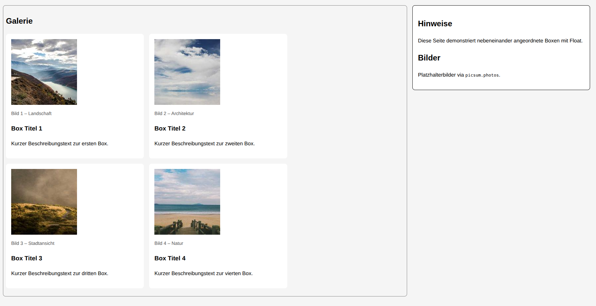

##  **Übung: Boxen nebeneinander mit Float und calc()**

## **1. Ausgangspunkt**

Speichere die Datei als **`index.html`**.
Erstelle außerdem eine **`style.css`** und binde sie im `<head>` ein.

###  **HTML – Gerüst**

Ergänze die fehlenden Bereiche (`...`) so, dass die Seite funktioniert.

```html
<!DOCTYPE html>
<html lang="de">
<head>
  <meta charset="UTF-8" />
  <title>Float & calc Übung</title>
  <link ...>
</head>
<body>
  <main>
    <section class="karten">
      <h2 id="galerie-ueberschrift">Galerie</h2>

      <article class="karte">
        <figure>
          
          <figcaption>Bild 1 – Landschaft</figcaption>
        </figure>
        <h3>Box Titel 1</h3>
        <p>Kurzer Beschreibungstext zur ersten Box.</p>
      </article>

      <article class="karte">
        <figure>
          
          <figcaption>Bild 2 – Architektur</figcaption>
        </figure>
        <h3>Box Titel 2</h3>
        <p>Kurzer Beschreibungstext zur zweiten Box.</p>
      </article>

      <article class="karte">
        <figure>
          
          <figcaption>Bild 3 – Stadtansicht</figcaption>
        </figure>
        <h3>Box Titel 3</h3>
        <p>Kurzer Beschreibungstext zur dritten Box.</p>
      </article>

      <article class="karte">
        <figure>
          
          <figcaption>Bild 4 – Natur</figcaption>
        </figure>
        <h3>Box Titel 4</h3>
        <p>Kurzer Beschreibungstext zur vierten Box.</p>
      </article>
    </section>
  </main>

  <aside>
    <section>
      <h2>Hinweise</h2>
      <p>Diese Seite demonstriert nebeneinander angeordnete Boxen mit Float.</p>
    </section>
    <section>
      <h2>Bilder</h2>
      <p>Platzhalterbilder via <code>picsum.photos</code>.</p>
    </section>
  </aside>
</body>
</html>
```

---

## **2. CSS – Aufgaben**

Erstelle eine Datei **`style.css`** und ergänze Schritt für Schritt:

### **Aufgabe A – Grundlayout**

1. Setze `box-sizing` global auf **content-box**.
2. Entferne Standardränder (margin/padding) aller Elemente.
3. Gib dem `body` etwas Außenabstand.


**Frage:** Warum wird hier `box-sizing: content-box` verwendet?

---

### **Aufgabe B – Spaltenlayout mit float**

1. Lass `<main>` und `<aside>` **nebeneinander erscheinen**.
2. Verwende `float: left;` und berechne die Breiten mit `calc()`
   (`main` = 70 % minus Abstand, `aside` = 30 %).
3. Gib `<main>` und `aside` einen sichtbaren Rand.

**Frage:** Warum wird `calc()` hier benutzt?


---

### **Aufgabe C – Karten nebeneinander**

1. Lass in `.karten` 2 Boxen nebeneinander stehen.
2. Verwende wieder `float` und `calc()` für die Breite.
3. Setze Außen- und Innenabstände so, dass ein klarer Gittereffekt entsteht.
4. Füge eine Hintergrundfarbe und abgerundete Ecken hinzu.


### 🔹 **Aufgabe D – Bilder und Texte**

1. Setze `figure`, `figcaption`, `h3` und `p` passend ab.
2. Lass die Bilder **automatisch an die Box angepasst** erscheinen.

```css
figure {
  margin: ....;
}

figcaption {
  margin-top: ...;
  font-size: ...;
  color: #555;
}

img {
  width: 100%;
  height: auto;
  border-radius: .25em;
}
```


 **Frage:** Warum bekommt das `` hier `width: 100%`?


Das Ergebnis sollte wie folgt aussehen:


