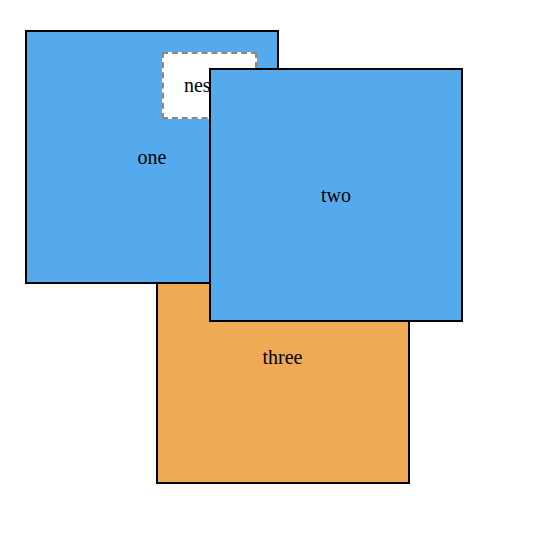

# 9. Position II

> Lernziele
> - Stacking Kontext
>   - z-index
> - sticky

**wiederholung**

- css position Eigenschaft
```css
- h1 {
    position: Wert
}
```
- mögliche werte:
1. absolute
    - hier können wir das absolute Kindelement relative zum Elternkontainer verschieben
2. relative
    - wir können mit top bzw. bottom und left bzw. right
        das element in relation zur ursprünglichen Position verschieben
        - der Dokumentfluss bleibt erhalten
    - wenn wir nur postion:relative angeben gibt es keine Visuellen Effekt auf das Element
    - meistens wird relative verwendet, um einen Elternkontainer for absolute Kinderelement zu schaffen
3. fixed
    - Element wird relative zum Viewport ausgerichtet und fixiert
        - und verbleibt an dieser Position selbst wenn die Seite gescrollt wird
    - mit `top, left, bottom, right` können wir sowohl die position als auch die Breite und Höhe relative zum Viewport definieren
    - Element wird aus dem Dokumentenfluss rausgenommen

https://pe.app/response_links/49ec38e7-9db9-43e3-ac68-12711bc39d9d 

### Creating a CSS triangle

* Es soll ein **kleiner Pfeil nach unten** zum Label hinzugefügt werden.
* Dieser Pfeil wird über das **::after-Pseudo-Element** des Labels erstellt.

* Wenn ein Element sehr große Border-Werte und **Breite/Höhe = 0** hat, entstehen **Dreiecke**.

* Jede Kante der Border bildet ein Dreieck:

    * top-Border zeigt nach unten
    * right-Border zeigt nach links
    * usw.

* Um einen nach unten zeigenden Pfeil zu erzeugen:

  * left- und right-Border werden **transparent**
  * top-Border wird **sichtbar** gefärbt → entsteht ein Dreieck nach unten


* Dieses Dreieck wird per **absolute positioning** rechts im Label platziert.

```css
.dropdown-label {
  padding: 0.5em 2em 0.5em 1.5em;
  border: 1px solid #ccc;
  background-color: #eee;
}

.dropdown-label::after {
  content: "";
  position: absolute;
  right: 1em;
  top: 1em;
  border: 0.3em solid;
  border-color: black transparent transparent;
}

.dropdown:hover .dropdown-label::after {
  top: 0.7em;
  border-color: transparent transparent black;
}
```

* Das **Pseudo-Element** hat **keine Breite und keine Höhe**, daher können die **Borders** sich in der Mitte treffen und ein Dreieck bilden.

 Mit `border-color` werden die Kanten eingefärbt:

  * **oben schwarz**,
  * **rechts/links transparent** → dadurch entsteht ein **nach unten zeigender Pfeil**.

* Die zusätzliche **rechte Innenabstand (padding)** des Labels schafft Platz für das Dreieck.

* Das Ergebnis ist ein klar erkennbarer **Dropdown-Pfeil**

* Beim Öffnen des Menüs wird der **Pfeil umgedreht**, sodass er **nach oben zeigt** und signalisiert, dass das Menü wieder geschlossen werden kann.

* Der kleine Unterschied im **top-Wert** (von `1em` zu `0.7em`) sorgt dafür, dass beide Pfeile optisch **an derselben Stelle** wirken.

* Statt ein Bild oder Icon zu verwenden, spart diese reine CSS-Lösung eine zusätzliche **Netzwerk-Anfrage**.

* Dieselbe Border-Technik kann für viele weitere **CSS-Formen** genutzt werden (z. B. Trapeze, Hexagone, Sterne).

* Eine große Sammlung solcher Formen findet man auf: https://css-tricks.com/examples/ShapesOfCSS/.

## Stacking contexts and z-index

* Positionierung ist sehr nützlich, aber sie hat **Folgen**, weil ein positioniertes Element **aus dem normalen Dokumentfluss entfernt** wird.

* Dadurch übernimmt der Browser nicht mehr automatisch Funktionen wie:

  * Layout anderer Elemente anpassen,
  * Überschneidungen vermeiden.

* Früher oder später tritt ein Problem mit **Überlagerungen (Stacking)** auf.

* in der aktuellen Seite (siehe live code):

* erscheint das **Dropdown VOR dem Modal**.
* (wenn das Modal/Dialogbox geöfnet ist)

# Rendering Prozess und Stacking Reihenfolge

* Beim Einlesen des HTML baut der Browser nicht nur den **DOM-Baum**, sondern auch einen **Render-Tree**.

* Der Render-Tree enthält **alle sichtbaren Elemente**, inklusive ihrer **Position** und **Darstellung**.

* Er bestimmt außerdem die **Reihenfolge**, in der Elemente **gezeichnet** werden.

* Diese Zeichenreihenfolge ist entscheidend:

    * **Später gemalte Elemente erscheinen vorne**,
    * **früher gemalte hinten**, wenn sich Elemente überlappen.

* Ohne Positionierung gilt eine einfache Regel:

   * **Die Reihenfolge im HTML bestimmt die Stacking-Reihenfolge.**   
   * Ein Element, das im HTML später steht, wird **über** den vorherigen gezeichnet.


* Beispiel:

  ```html
  <div>one</div>
  <div>two</div>
  <div>three</div>
  ```

   * Ohne position oder z-index:

    * **three** liegt über **two**,
       * **two** liegt über **one**,
    * wenn sie sich überlagern

* Sobald Elemente **positioniert** werden (`relative`, `absolute`, `fixed`, `sticky`), ändert sich die Reihenfolge, in der der Browser sie zeichnet.

* Der Browser zeichnet zuerst **alle nicht positionierten Elemente** (`static`).

* Danach zeichnet er **alle positionierten Elemente**.

* Dadurch liegen **positionierte Elemente automatisch vor statischen**, selbst wenn sie im HTML früher stehen.

* Beispiel:

  * Element 1 → `position: relative`
  * Element 2 → `position: relative`
  * Element 3 → `position: static`

* Reihenfolge der Darstellung:

   1. Element 3 (static, wird zuerst gemalt → liegt hinten)
   2. Element 1 (positioned)
   3. Element 2 (positioned, später im HTML → liegt über Element 1)

* Innerhalb der **Gruppe der positionierten Elemente** bleibt die Reihenfolge weiterhin **vom HTML abhängig**:

 Welches der beiden (Dropdown und Modal) vorne liegt, hängt aktuell **nur von der Reihenfolge im HTML** ab.

* Eine einfache Lösung wäre, das gesamte

  ```html
  <div class="modal"> … </div>
  ```

  **ans Ende des HTML**, direkt vor `</body>` zu verschieben.

* Viele JavaScript-Libraries tun genau das: Sie hängen Modals **automatisch** ans Ende des Body.

* Durch **position: fixed** ist es egal, wo das Modal im Markup steht – es bleibt trotzdem zentriert auf dem Bildschirm.

* die Stacking-Reihenfolge unabhängig vom HTML zu steuern, erflogt durch z-index

### Manipulating stacking Reihenfolge mit z-index

 **z-index** ist eine ganze Zahl (auch negativ möglich) und steuert die **Tiefe (Z-Achse)** eines Elements.

* Ein höherer z-index bedeutet: **Element liegt weiter vorne**.
* Ein negativer z-index bedeutet: **Element liegt hinter statischen Elementen**.

* Für dein Modal:
    * **modal-backdrop** → z-index: 1
    * **modal-body** → z-index: 2
* Dadurch liegt der Inhalt des Modals **vor** dem halbtransparenten Hintergrund.

* **z-index wirkt nur auf positionierte Elemente**.

* Statische Elemente (`position: static`) können **nicht** mit z-index nach vorne oder hinten sortiert werden.

* Wenn man einem positionierten Element einen **z-index** gibst, erzeugst du damit automatisch einen **Stacking Context**.

###  stacking contexts verstehen

* Ein **Stacking Context** ist eine Gruppe von Elementen, die der Browser **als Einheit** malt.

* Das Element, dem man einen **z-index** gibst (und das positioniert ist), wird der **Root** eines neuen Stacking Contexts.

* Alle **Nachfahren** dieses Elements gehören ebenfalls zu diesem Stacking Context.

  * Elemente **außerhalb** eines Stacking Contexts können **nicht zwischen** dessen internen Elementen „einsortiert“ werden.

  * Beispiel:

 * Wenn ein Element **vor dem gesamten Stacking Context** liegt, kann **kein Kind** darin jemals vor dieses Element kommen.

* Wenn ein Element **hinter dem ganzen Stacking Context** liegt, kann **kein Kind** darin hinter dieses Element rutschen.

* Konsequenz:

* Ein Stacking Context wirkt wie eine **undurchbrechbare Ebene** — alles darin bleibt in seiner Schicht zusammen.
* Deshalb kann ein Element mit höherem z-index *außerhalb* eines Contexts trotzdem *über* einem Kind liegen, das eigentlich einen höheren z-index hat.

```html
<div class="box one positioned">
  one
  <div class="absolute">nested</div>
</div>

<div class="box two positioned">
  two
</div>

<div class="box three">
  three
</div>
```
```css
body {
  margin: 40px;
}

.box {
  display: inline-block;
  width: 200px;
  line-height: 200px;
  text-align: center;
  border: 2px solid black;
  background-color: #ea5;
  margin-left: -60px;
  vertical-align: top;
}

.one { margin-left: 0; }
.two { margin-top: 30px; }
.three { margin-top: 60px; }

.positioned {
  position: relative;
  background-color: #5ae;
  z-index: 1; /* eigener Stacking-Context, liegt unter späteren Elementen */
}

.absolute {
  position: absolute;
  top: 1em;
  right: 1em;
  height: 2em;
  background-color: #fff;
  border: 2px dashed #888;
  z-index: 100; /* bleibt dennoch hinter .two, da im Stacking-Context von .one */
  line-height: initial; /*setzt den Zeilenabstand auf den Standardwert des Browsers zurück.*/
  padding: 1em;
}
```


* **Trotz z-index: 100 erscheint „nested“ hinter der zweiten Box.**

* Grund:

  * Die erste Box (`.one.positioned`) hat **z-index: 1**
  * Sie bildet damit einen **eigenen Stacking Context**
  * Alle Kinder darin (auch das absolut positionierte „nested“) sind **an diesen Kontext gebunden**

* Die zweite Box (`.two.positioned`) hat ebenfalls `z-index: 1`,
  aber sie steht **später im DOM** → wird **über** der ersten Box gemalt.

* **Box one** ist der **Root eines Stacking Contexts** (wegen `position: relative` + `z-index: 1`).

* Deshalb kann das absolut positionierte Kind darin **niemals vor Box two** erscheinen – selbst mit `z-index: 100`.

 Der gesamte Stacking Context von Box one liegt **unterhalb** von Box two, weil Box two später im DOM steht und denselben z-index-Level hat.

* **Reihenfolge innerhalb eines Stacking Contexts** (von hinten nach vorne):

  1. **Root des Stacking Contexts**
  2. **Positionierte Elemente mit negativem z-index** (inkl. Kinder)
  3. **Nicht positionierte Elemente**
  4. **Positionierte Elemente mit `z-index: auto`** (inkl. Kinder)
  5. **Positionierte Elemente mit positivem z-index** (inkl. Kinder)

Diese Reihenfolge gilt **innerhalb** des Stacking Contexts – andere Stacking Contexts können nicht „dazwischen gemischt“ werden.

* Wenn **z-index nicht so wirkt wie erwartet**, liegt die Ursache fast immer in einem **übergeordneten Stacking Context**.


## Sticky positioning

* **Sticky Positioning** ist eine Mischung aus *relative* und *fixed*.

* Das Element scrollt **ganz normal**,
* bis es eine bestimmte Scroll-Position erreicht,
* dann bleibt es **fixiert** stehen, während der Rest der Seite weiter scrollt.

* Typischer Einsatz: **Sidebar-Navigation**, Inhaltsverzeichnisse, kleine Infoboxen.


* Für das Sticky-Verhalten braucht es nur **zwei Eigenschaften** im `.affix`-Element:

  * `position: sticky`
  * `top: 1em` → dort „klebt“ das Element am Viewportrand.

# Responsive Design

* Web ist auf vielen Geräten präsent: Desktop, Tablet, TV, Smartphone
* Herausforderung: Website muss auf allen Geräten **benutzbar** und **attraktiv** bleiben
* Früherer Ansatz: **zwei Websites** (Desktop + Mobile), automatische Weiterleitung

* Probleme dieses Ansatzes:
  * viele neue Gerätetypen (Tablet, Phablet, iPad Mini)  
  * Wartung von zwei Websites

* Besserer Ansatz: **ein HTML/CSS-Set für alle Geräte**
* Layout reagiert auf **Viewport-Größe** (oder Auflösung)

* Dieses Konzept = **responsive design** 

**Drei Prinzipien des Responsive Designs:**

1. **Mobile First** → zuerst mobile Version bauen, dann Desktop-Erweiterungen
2. **Media Queries (@media)** → Styles nur unter bestimmten Bedingungen anwenden
3. **Flüssige Layouts** → Container skalieren relativ zur Viewport-Breite

* Bilder benötigen in responsiven Designs besondere Behandlung 

## Mobile first

* **Mobile First** = zuerst das mobile Layout entwickeln
* Mobile Entwicklung bedeutet **starke Einschränkungen**:

  * wenig Platz
  * oft langsame Verbindung
  * andere Interaktionen (Touch statt Hover)
  * Tippen ist möglich, aber unbequem

* Danach → **progressive Verbesserung**: größere Bildschirme erhalten zusätzliche Funktionen
* Suchmaschinen bevorzugen mobil-optimierte Seiten (SEO-Vorteil)
* Weniger Code-Duplikation
* Bessere **Performance**: weniger CSS/JS, schnellere Ladezeiten für alle Geräte
* Einfachere Wartung und weniger technische Schulden
* Verbesserte **Barrierefreiheit**: klare, reduzierte Strukturen funktionieren für mehr Nutzer
* Schnellere Entwicklungszeit, da Desktop nur eine Erweiterung der mobilen Basis ist
* Mobile-first-Design verhindert Layout-Brüche bei kleinen Viewports

