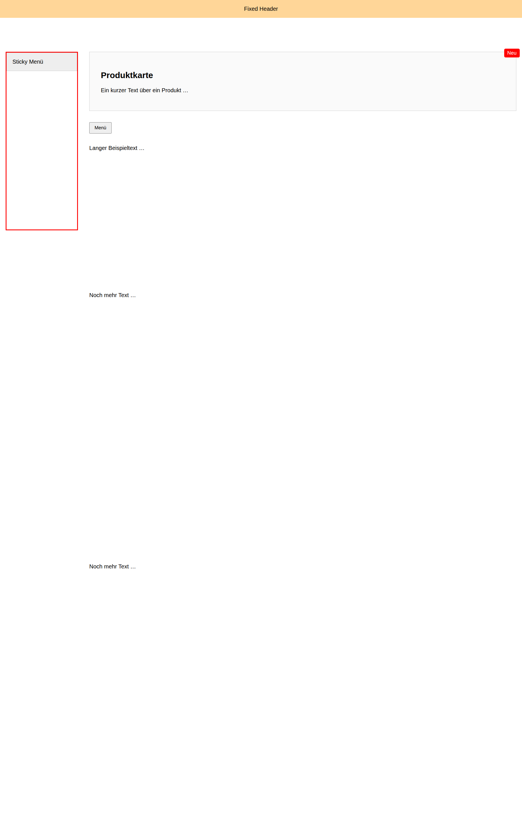

## **Mini-Projekt: Layout mit Sticky, Absolute, Relative & Fixed**

**Kurzbeschreibung:**
Baue eine kleine Seite mit folgenden vier Positionierungsarten:

1. **Fixed Header** – bleibt immer oben sichtbar.
2. **Relative Container + Absolute Badge** – ein Label klebt oben rechts innerhalb eines Cards.
3. **Sticky Sidebar** – bleibt beim Scrollen kleben.
4. **Absolute Dropdown** – Menü klappt unter dem Button aus.

