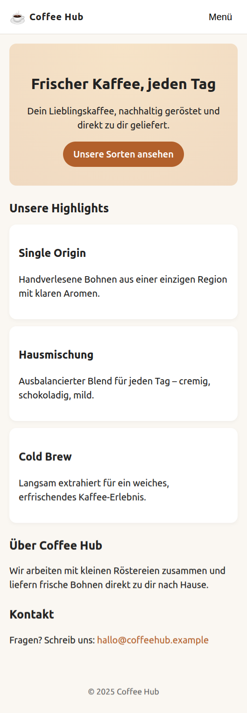
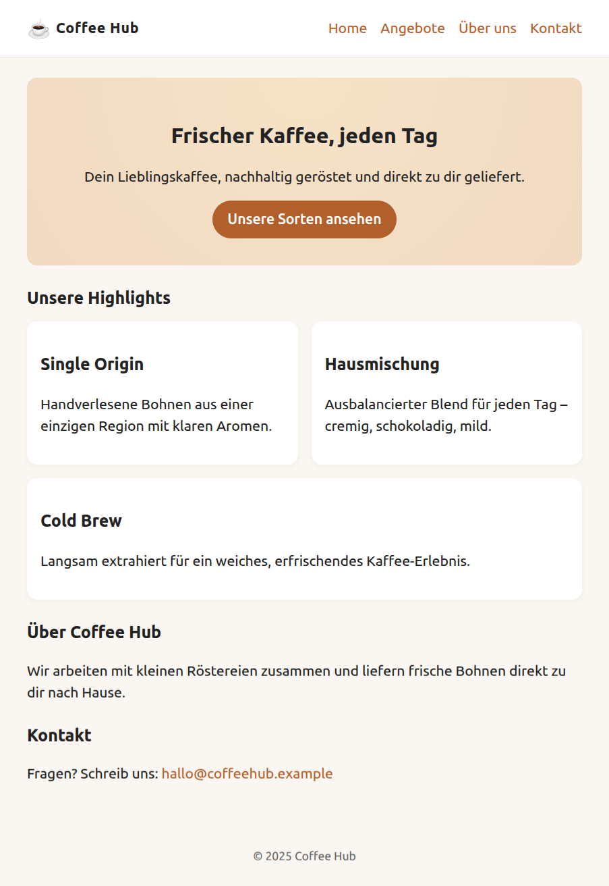
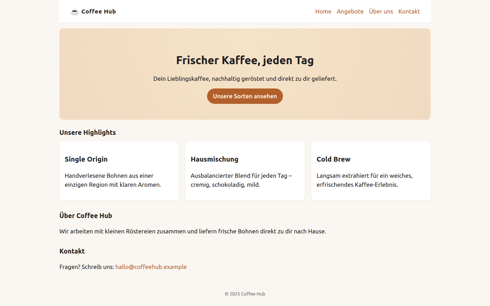

```html
<!DOCTYPE html>
<html lang="de">
<head>
  <meta charset="UTF-8" />
  <title>Responsive Coffee Landingpage</title>
  <meta name="viewport" content="width=device-width, initial-scale=1" />
  <!-- style.css wird in der Übung Schritt für Schritt aufgebaut -->
  <link rel="stylesheet" href="style.css" />
</head>
<body>
  <header class="site-header">
    <div class="brand">
      <span class="logo">☕</span>
      <span class="brand-name">Coffee Hub</span>
    </div>

    <nav class="main-nav" id="main-nav">
      <button class="nav-toggle" id="nav-toggle" aria-expanded="false" aria-controls="nav-links">
        Menü
      </button>
      <ul class="nav-links" id="nav-links">
        <li><a href="#hero">Home</a></li>
        <li><a href="#features">Angebote</a></li>
        <li><a href="#about">Über uns</a></li>
        <li><a href="#contact">Kontakt</a></li>
      </ul>
    </nav>
  </header>

  <main>
    <section id="hero" class="hero">
      <h1>Frischer Kaffee, jeden Tag</h1>
      <p>Dein Lieblingskaffee, nachhaltig geröstet und direkt zu dir geliefert.</p>
      <a href="#features" class="btn-primary">Unsere Sorten ansehen</a>
    </section>

    <section id="features" class="features">
      <h2>Unsere Highlights</h2>
      <div class="card-grid">
        <article class="card">
          <h3>Single Origin</h3>
          <p>Handverlesene Bohnen aus einer einzigen Region mit klaren Aromen.</p>
        </article>
        <article class="card">
          <h3>Hausmischung</h3>
          <p>Ausbalancierter Blend für jeden Tag – cremig, schokoladig, mild.</p>
        </article>
        <article class="card">
          <h3>Cold Brew</h3>
          <p>Langsam extrahiert für ein weiches, erfrischendes Kaffee-Erlebnis.</p>
        </article>
      </div>
    </section>

    <section id="about" class="about">
      <h2>Über Coffee Hub</h2>
      <p>Wir arbeiten mit kleinen Röstereien zusammen und liefern frische Bohnen direkt zu dir nach Hause.</p>
    </section>

    <section id="contact" class="contact">
      <h2>Kontakt</h2>
      <p>Fragen? Schreib uns: <a href="mailto:hallo@coffeehub.example">hallo@coffeehub.example</a></p>
    </section>
  </main>

  <footer class="site-footer">
    <p>&copy; 2025 Coffee Hub</p>
  </footer>

  <script>
    (function () {
      const toggle = document.getElementById('nav-toggle');
      const nav = document.getElementById('main-nav');

      toggle.addEventListener('click', function (event) {
        event.preventDefault();
        nav.classList.toggle('is-open');

        const isOpen = nav.classList.contains('is-open');
        toggle.setAttribute('aria-expanded', isOpen ? 'true' : 'false');
      });
    })();
  </script>
</body>
</html>
```

---

## Teil 1 – Mobile-First Grundlayout (ohne Media Queries)

**Aufgabe:**

1. Setze ein globales Box-Modell (`border-box`) und eine gut lesbare Schrift.
2. Gestalte das mobile Layout:

   * Navigation: Burger-Button sichtbar, Menü-Links zunächst versteckt.
   * Header, Hero, Sections: einfache einspaltige Darstellung, volle Breite, etwas Abstand.
   * Buttons und Links gut tappbar machen.
3. Bilder allgemein nicht über den Container hinauslaufen lassen.


**Fragen**

* Frage: Warum schreiben wir mobile Styles **ohne** Media Queries?





---

## Teil 2 – Erster Breakpoint (Navigation horizontal, Karten in zwei Spalten)

**Aufgabe:**

1. Füge einen Breakpoint bei z. B. `min-width: 40em` hinzu.
2. Ab diesem Breakpoint:

   * Navigation: Burger-Button ausblenden, Menü immer sichtbar, Links nebeneinander anordnen.
   * Features: Karten in zwei Spalten (3. Karte läuft in nächste Zeile).
3. Seitenabstände leicht erhöhen, damit alles auf größeren Screens luftiger wirkt.

**Fragen**

* Frage: Warum verwenden wir `min-width` statt `max-width`?
* Frage: Warum eignet sich Flexbox gut für die horizontale Navigation?





## Teil 3 – Zweiter Breakpoint (breite Desktops, Layout noch großzügiger)

**Aufgabe:**

1. Füge einen zweiten Breakpoint bei `min-width: 64em` hinzu.
2. Ab diesem Breakpoint:

   * Seite in einen zentrierten Container setzen (maximale Breite z. B. 70rem).
   * Hero-Bereich größer machen (mehr Padding, etwas größere Schrift).
   * Navigation und Footer an die größere Breite anpassen.

