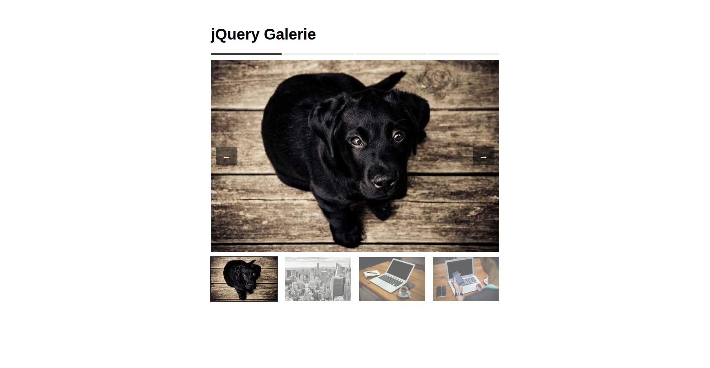
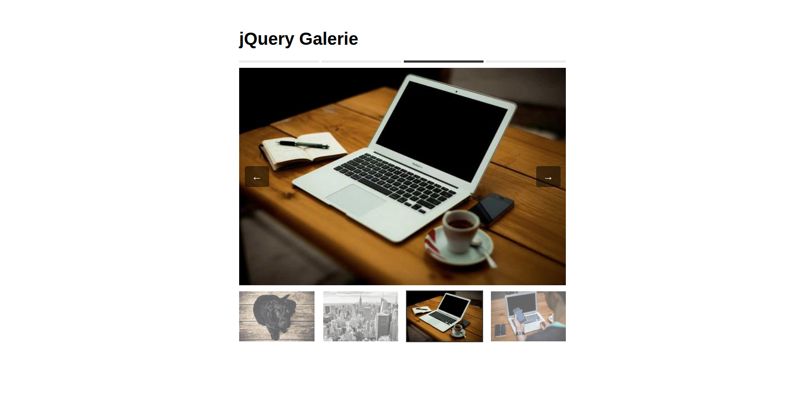

# **ÜBUNG: jQuery-Galerie mit Progress-Bar & Navigation**

## **Ziel der Übung**

Du baust eine kleine Bildergalerie mit jQuery:

* Thumbnails zum Anklicken
* Hauptbild wechselt mit Fade-Effekt
* Fortschrittsleiste über den Thumbnails
* Links/Rechts-Buttons zum Weiterblättern
* jQuery-Event-Handling üben
* DOM-Manipulation (Klassen, Attribute, CSS ändern)






# **1. HTML-Grundgerüst (mit Lücken)**

- ergänze den fehlenden Teile selbst

```html
<!DOCTYPE html>
<html lang="de">
<head>
    <meta charset="UTF-8">
    <title>jQuery Galerie</title>


    <!-- CSS-Datei der Schüler -->
    <link rel="stylesheet" href="style.css">
</head>
<body>

<div class="gallery">

    <h1>jQuery Galerie</h1>

    <div class="main">
        <button id="prev">&#8592;</button>
        
        <button id="next">&#8594;</button>
    </div>


    <!-- THUMBNAILS -->
    <div class="thumbs">
        

        

        

        
    </div>

</div>
    <!-- jQuery einbinden -->
    <script src="https://code.jquery.com/jquery-3.7.1.min.js"></script>

    <!-- Eigene JS-Datei -->
    <script src="script.js" defer></script>
</body>
</html>
```

fülle **Bilderlinks**, und **SRC-Werte** selbst aus (z. B. mit picsum.photos).


# **2. jQuery-Code (vollständig vorgegeben)**


```javascript
$(function () {

    const thumbs = $(".thumb");
    const count = thumbs.length;
    let currentIndex = 0;

    // --- Progress Bar erstellen ---
    const bar = $("#progress-bar");
    for (let i = 0; i < count; i++) {
        $("<div></div>").addClass("bar-item").appendTo(bar);
    }

    function updateBar(index) {
        $(".bar-item").removeClass("active");
        $(".bar-item").eq(index).addClass("active");
    }

    updateBar(0);

    // --- Hauptbild wechseln ---
    function showImage(index) {
        const big = thumbs.eq(index).data("big");

        $("#main-img").fadeOut(150, function () {
            $(this).attr("src", big).fadeIn(150);
        });

        thumbs.removeClass("active");
        thumbs.eq(index).addClass("active");

        updateBar(index);
        currentIndex = index;
    }

    // --- Thumbnail Klick ---
    thumbs.on("click", function () {
        const index = thumbs.index(this);
        showImage(index);
    });

    // --- Buttons ---
    $("#prev").on("click", function () {
        const newIndex = (currentIndex - 1 + count) % count;
        showImage(newIndex);
    });

    $("#next").on("click", function () {
        const newIndex = (currentIndex + 1) % count;
        showImage(newIndex);
    });

    // --- Keyboard Navigation ---
    $(document).on("keydown", function(e) {
        if (e.key === "ArrowLeft") $("#prev").click();
        if (e.key === "ArrowRight") $("#next").click();
    });

});
```


# **3. CSS **


###  **Beschreibung**

Stylt folgende Elemente:

* `.gallery` → zentrierter Block, max-width, Außenabstand
* `#main-img` → 100% Breite
* `.thumbs` → Flexbox, Abstand zwischen Bildern
* `.thumb` → kleine Bilder, `cursor: pointer`, geringe opacity
* `.thumb.active` → deutliche Markierung (z. B. Rahmen + volle opacity)
* `#progress-bar` → horizontale Leiste mit 4 dünnen Balken
* `.bar-item` → graue Balken, einer dunkel
* `#prev`, #next` → Buttons neben dem Hauptbild (oder darunter)

###  **Tipps**

* Nutze `display: flex;` für `.thumbs`
* Nutze `max-width:` für `.gallery`
* Buttons können klein bleiben
* Progressbar soll über den Thumbs sitzen → `.thumbs { margin-top: ... }`


### Ergebnis:

* jQuery-Galerie mit:

    * Hauptbild
    * Thumbnails
    * Fortschrittsbalken über den Thumbnails
    * Buttons „Zurück“ und „Weiter“
    * Fade-Effekt beim Bildwechsel

### **Deine Schritte:**

1. Ergänze die fehlenden Stellen im HTML.
2. Schreibe eigenes CSS.
3. Verwende die vorgegebene `script.js`.
4. Teste die Galerie im Browser.

